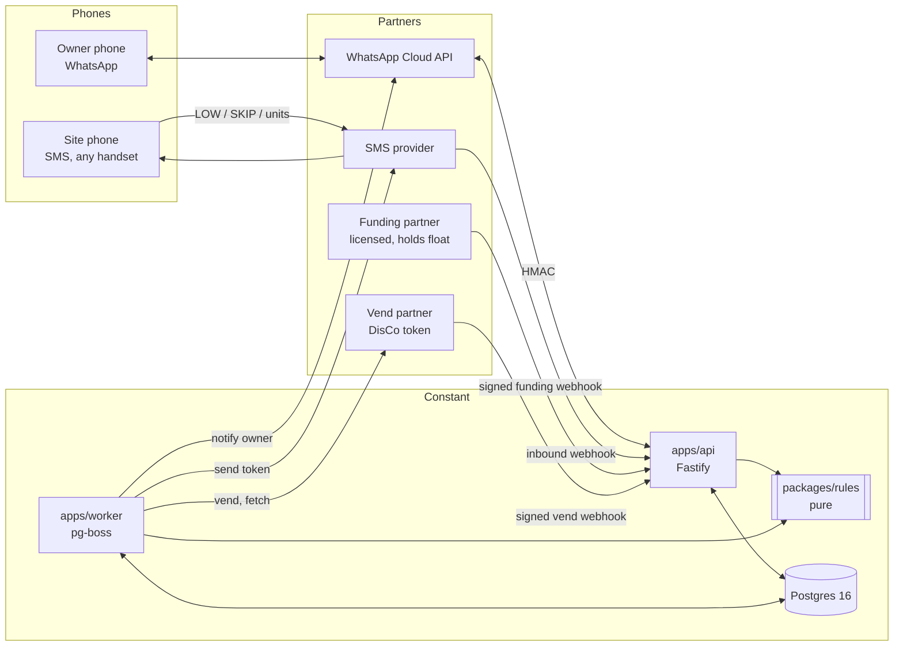

# Architecture

## Shape of the system



Two processes, one database, one pure library.

- **apps/api** receives everything from the outside world, verifies its signature, stores the raw payload, and either answers from `packages/rules` or enqueues a job. It never calls the vend partner.
- **apps/worker** is the only process that spends money. It runs the schedule scan, the vend, the notify and the reconcile jobs.
- **packages/rules** decides. No I/O.
- **Postgres** is the support record: every naira, every order state, every inbound message. If it is not in Postgres it did not happen.

The primary trigger is the clock, not a message. WhatsApp is how the owner configures the loop and how either phone sends an exception (LOW, SKIP, STOP).

## Why these choices

| Choice | Reason |
|---|---|
| TypeScript, Node 22 | One language across api, worker, rules; the team can hire for it in Lagos and Nairobi. |
| Fastify | Raw body access for HMAC checks, mature rate-limit and schema plugins, good pino logging with redaction (D-002). |
| Postgres 16 | Transactions, unique constraints for idempotency, row locks for the one-open-order rule, point-in-time recovery. |
| pg-boss | Jobs live in the same Postgres, so "insert order + enqueue vend" is one transaction. No Redis to run or lose. |
| bigint minor units | Integer money in every market (D-003). |
| Monorepo, pnpm | Rules are shared by api and worker without publishing. |

## Data model

Money columns are `bigint` minor units with a `currency` on the site. Times are `timestamptz`. Names differ from the original spec where noted in `DECISIONS.md`.

```
markets            code PK ('NG'), currency ('NGN'), time_zone ('Africa/Lagos'),
                   default_locale, fee_per_buy_minor (D-020), enabled
owners             id, phone_e164 UNIQUE, locale, market_code, created_at
sites              id, owner_id, market_code, site_phone_e164, mode ('schedule'|'alert'),
                   utility_code ('IKEDC'), meter_ciphertext, meter_hmac, meter_last4,
                   verified, verified_name,
                   buy_amount_minor, weekdays smallint[], run_minute_local DEFAULT 420,
                   alert_threshold_units, weekly_cap_minor, min_hours_between_buys DEFAULT 20,
                   status ('active'|'frozen'), frozen_reason,
                   next_run_at, last_buy_at, last_unit_price_milli_minor,
                   funding_account_ref, funding_display (bank + number, or paybill + account),
                   balance_minor  -- cache; written only in the same tx as a ledger entry
                   site_phone_can_low DEFAULT true
ledger_entries     APPEND ONLY. id, site_id, kind ('fund'|'vend'|'fee'|'refund'|'adjust'|'reversal'),
                   amount_minor (signed), idempotency_key UNIQUE, external_ref, actor, created_at
orders             id, site_id, trigger ('schedule'|'low'), state, amount_minor,
                   idempotency_key UNIQUE, scheduled_for, partner_ref, error,
                   receipt_id UNIQUE (unguessable), evidence_sha256, created_at, updated_at
                   PARTIAL UNIQUE (site_id) WHERE state IN open states   -- D-004
order_tokens       order_id, seq, kind ('credit'|'kct1'|'kct2'), token_ciphertext, token_sha256,
                   token_last4, received_at   -- D-015: a vend can return more than one token
order_events       order_id, from_state, to_state, event, detail jsonb, at   -- audit trail
skips              site_id, skipped_run_at, UNIQUE (site_id, skipped_run_at)
inbound_messages   provider, provider_id UNIQUE, from_phone, body, raw jsonb, received_at
funding_events     provider, provider_event_id UNIQUE, site_id, amount_minor,
                   status ('pending'|'credited'|'reversed'), raw jsonb
notices            idempotency_key UNIQUE, site_id, kind, channel, sent_at, provider_msg_id
alerts             id, site_id, units, created_at
onboarding         owner_id, site_id, step, answers jsonb, updated_at
system_flags       key PK ('vending_enabled'), value, changed_by, reason, changed_at
```

Balance is the ledger sum. `balance_minor` on the site is a cache that is only ever changed in the same transaction as the ledger insert, and reconciliation checks it nightly.

No raw meter number is stored in clear. `meter_hmac` is HMAC-SHA256 under its own key, because an 11–13 digit number is brute-forced in seconds from a plain hash (D-012).

## The two money transactions

**Schedule scan** (pg-boss singleton, every minute):

```
for each site id WHERE mode='schedule' AND status='active' AND verified AND next_run_at <= now():
  BEGIN
    SELECT … FROM sites WHERE id = $1 FOR UPDATE          -- serialises with LOW and funding
    gather: ledger balance, week spend (non-failed orders since weekStart), open order?,
            skip for next_run_at?, vending_enabled
    d = decideSchedule(…);  a = scanAction(d)
    vend               → INSERT order (key = scheduleOrderKey); next_run_at = nextRunAfterBuy(now)
                         pg-boss send('vend', orderId)     -- same transaction
    advance            → next_run_at = nextSlotAfter(next_run_at)
    advance_and_notify → same, plus INSERT notice (key = noticeKey) and send('notify')
    hold               → nothing
  COMMIT
```

**LOW** (from the api, on a verified inbound message): the same lock, the same `decideSchedule` with `trigger='low'`, key `lowOrderKey(site, providerMessageId)`. So a retried WhatsApp webhook finds the existing order and answers from it.

The site row lock plus the partial unique index on open orders are what make invariant 6 hold under concurrency. The rule function alone cannot.

## Vend job

```
load order FOR UPDATE; if state != 'ready' → already handled, exit
state → vending (persist)                          -- before the HTTP call
[mandate spend here, once it exists — D-011]
res = vending.vend(order)                          -- idempotency key = order id
  accepted(ref)  → persist partner_ref; INSERT ledger vend (vendLedgerKey) + fee (feeLedgerKey) — one tx
  token          → as accepted, then store tokens; state → token_stored
  rejected       → state → failed; notify owner (vend failed)
  timeout/unknown→ stay vending; schedule fetch in 1, 5, 15, 60 min
on worker start: every order in 'vending' → recoverVending(partner_ref)
  ref saved   → fetch
  no ref      → needs_human, freeze site, page ops
```

Token arrives (webhook or fetch) → store encrypted tokens → `token_stored` → `notifying` → send SMS to site phone and WhatsApp to owner → `settled`, set `last_buy_at`, `last_unit_price`. SMS failure keeps `notifying` and retries sending the stored token with back-off; after N failures it pages ops. It never re-vends.

## Partner interfaces (packages/partners)

```ts
interface Vending {
  lookupMeter(utility, meter): Promise<{ ok: true; name: string; address?: string } | { ok: false; reason }>
  quote?(utility, meter, amountMinor): Promise<{ milliMinorPerUnit: bigint; debtMinor?: bigint }>  // only if side-effect free
  vend(req: { orderId; utility; meter; amountMinor }): Promise<VendResult>   // accepted | token | rejected | unknown
  fetch(partnerRef): Promise<VendResult>
  verifyWebhook(rawBody, headers): VendWebhook | null
}

interface Funding {
  createFundingAccount(site): Promise<{ ref: string; display: FundingDisplay }>  // NG: virtual NUBAN; KE: paybill + account no.
  parseWebhook(rawBody, headers): FundingEvent | null                           // null = bad signature
}

interface Messaging {
  sendSms(toE164, text): Promise<{ providerId }>
  sendWhatsApp(toE164, templateOrText): Promise<{ providerId }>
}

interface Attestor { /* D-011: declared, not implemented */ }
```

Chosen adapters for the pilot: VTpass (vending, D-024), Paystack dedicated virtual accounts (funding, D-022), Termii then Africa's Talking (SMS, D-025). Hosting: D-026.

Each has a `Fake*` used in tests and local dev (FakeVending returns a deterministic 20-digit token from the order id) and one real adapter per market.

## Security

- Separate keys: `METER_ENCRYPTION_KEY`, `METER_HMAC_KEY`, `TOKEN_ENCRYPTION_KEY`, plus webhook secrets per partner. Server-only; never `VITE_` or `NEXT_PUBLIC_`.
- AES-256-GCM with a key id prefix on every ciphertext, so keys can rotate.
- Every inbound webhook: verify the signature on the raw bytes before parsing; reject old timestamps where the provider sends them.
- Logger redacts any run of 11+ digits, and any field named `token`, `meter`, `phone`. Log `meter_last4`, `token_sha256`.
- Receipt ids: 16+ random bytes, base62. Receipt page rate-limited per IP and per id; shows meter last 4, amount, status, token last 4, no phone, no full token.
- Rate limits: LOW per site, inbound per phone, receipt page.
- Ops actions (unfreeze, resolve needs_human, clear kill switch) require two people once there are two people, and always write `order_events` / `system_flags` with the actor.
- NDPA (Nigeria): data collected is phone, meter, transactions. Privacy page, retention schedule, no contact upload. Pick a hosting region with the data-transfer rules in mind (see OPERATIONS).

## Observability

Structured JSON logs (pino) with the redaction above. Metrics that matter to the business and to on-call:

- vends due vs vends created vs settled, per hour
- age of the oldest `vending` order; count of `needs_human`
- SMS delivery failures; time from settle to SMS delivered
- funding credited per day; reversals
- `vending_enabled` state

Page a human when: any `needs_human`, any `vending` older than 60 minutes, `vending_enabled` goes false, or the scan did not run for 5 minutes.

## What is deliberately absent

No web dashboard, no mobile app, no card payments, no meter reading, no LLM, no chain in the money path. See `PLAN.md` "Not in v1".
